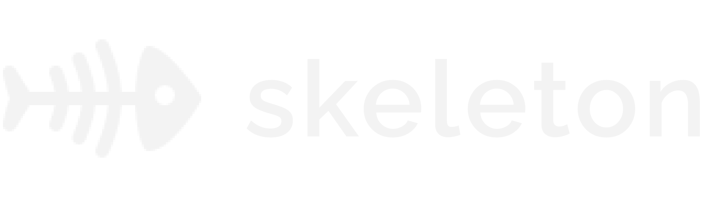

<div id="top"></div><!-- PROJECT LOGO -->
<br />
<div align="center">
  <a href="https://github.com/outoflaksh/skeleton">
    
  </a>

<h3 align="center">Integration Architecture Document Generation</h3>

  <p align="center">
    Automatically generate an integration architecture document for your codebase. Currently supporting Express.js
    <br />
    <a href="https://github.com/outoflaksh/skeleton"><strong>Explore the docs »</strong></a>
    <br />
    <br />
    <a href="https://github.com/outoflaksh/skeleton/blob/main/sample_integration_doc.json">View Sample</a>
    ·
    <a href="https://github.com/outoflaksh/skeleton/issues">Report Bug</a>
    ·
    <a href="https://github.com/outoflaksh/skeleton/issues">Request Feature</a>
  </p>
</div>


<!-- TABLE OF CONTENTS -->
<details>
  <summary>Table of Contents</summary>
  <ol>
    <li>
      <a href="#about-the-project">About The Project</a>
      <ul>
        <li><a href="#built-with">Built With</a></li>
      </ul>
    </li>
    <li>
      <a href="#getting-started">Getting Started</a>
      <ul>
        <li><a href="#prerequisites">Prerequisites</a></li>
        <li><a href="#installation">Installation</a></li>
      </ul>
    </li>
    <li><a href="#usage">Usage</a></li>
    <li><a href="#roadmap">Roadmap</a></li>
    <li><a href="#contributing">Contributing</a></li>
    <li><a href="#license">License</a></li>
    <li><a href="#contact">Contact</a></li>
  </ol>
</details>


<!-- ABOUT THE PROJECT -->
## About The Project

Skeleton helps development teams connect and work with each other better without having to know anything about the other's codebase. Imagine two different teams, working on different services. What if Team A wants to integrate with Team B's application? They would need to know the entire integration architecture of Team B's app. This is where Skeleton comes in!

With Skeleton, Team A can instantly and automatically generate a whole document containing all the information needed to connect with Team B's codebase.

Skeleton provides the following information in the document:
1. All instances of external HTTP APIs.
2. All the different external libraries and modules being used.
3. All internal endpoints that Team A can use to connect to Team B.
4. Security scan for loose API keys and secrets.
5. Scan results for any outdated libraries and packages.
6. Scan results for other protocols like FTP, SFTP, and more!

<p align="right">(<a href="#top">back to top</a>)</p>


### Built With

* Python
* JavaScript
* FastAPI
* React.js
* Node.js

<p align="right">(<a href="#top">back to top</a>)</p>


<!-- GETTING STARTED -->
## Getting Started

### Prerequisites

Make sure to have Node.js and Python installed on your system.
* npm
  ```sh
  npm install npm@latest -g
  ```

### Installation

1. Get a free API Key at [https://gitguardian.com](https://gitguardian.com)
2. Clone the repo
   ```sh
   git clone https://github.com/outoflaksh/skeleton.git
   ```
3. Install Python packages
   ```sh
   pip3 install -r requirements.txt
   ```
4. Enter your API in `.env`
   ```
   GITGUARDIAN_API_KEY=ENTER YOUR API KEY
   ```
5. Run the following to start the Skeleton API
   ```sh
   uvicorn api:app
   ```


<p align="right">(<a href="#top">back to top</a>)</p>


<p align="right">(<a href="#top">back to top</a>)</p>


<!-- ROADMAP -->
## Roadmap

- [ ] Support for more languages and frameworks.
- [ ] More in-depth security scans.
- [ ] A more comprehensive description of all the different endpoints. 

See the [open issues](https://github.com/outoflaksh/skeleton/issues) for a full list of proposed features (and known issues).

<p align="right">(<a href="#top">back to top</a>)</p>


<!-- CONTRIBUTING -->
## Contributing

Contributions are what make the open source community such an amazing place to learn, inspire, and create. Any contributions you make are **greatly appreciated**.

If you have a suggestion that would make this better, please fork the repo and create a pull request. You can also simply open an issue with the tag "enhancement".
Don't forget to give the project a star! Thanks again!

1. Fork the Project
2. Create your Feature Branch (`git checkout -b feature/AmazingFeature`)
3. Commit your Changes (`git commit -m 'Add some AmazingFeature'`)
4. Push to the Branch (`git push origin feature/AmazingFeature`)
5. Open a Pull Request

<p align="right">(<a href="#top">back to top</a>)</p>


<!-- LICENSE -->
## License

Distributed under the MIT License. See `LICENSE.txt` for more information.

<p align="right">(<a href="#top">back to top</a>)</p>


<!-- CONTACT -->
## Contact

Lakshya Malik - @outoflaksh (Twitter, GitHub, Instagram)

Project Link: [https://github.com/outoflaksh/skeleton](https://github.com/outoflaksh/skeleton)

<p align="right">(<a href="#top">back to top</a>)</p>


<!-- MARKDOWN LINKS & IMAGES -->
<!-- https://www.markdownguide.org/basic-syntax/#reference-style-links -->
[contributors-shield]: https://img.shields.io/github/contributors/outoflaksh/skeleton.svg?style=for-the-badge
[contributors-url]: https://github.com/outoflaksh/skeleton/graphs/contributors
